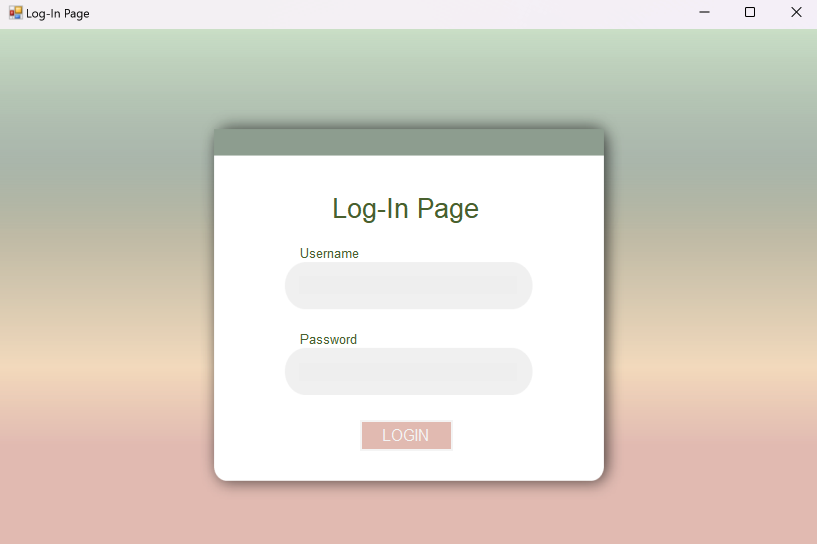

# Multiple-Forms-And-Calculator

## 📜 Description
This is a simple **Windows Forms** application featuring three types of calculators—Basic Calculator, Area of a Square, and Area of a Circle. It is built using **C#** and **.NET Framework**, offering a user-friendly interface to input and compute grades for a computer programming subjects. 

---

## 🚀 How to Run the Application (Using the Executable File)

1. **Download** the `Marinay - Activity 4.exe` file (located in the `bin/Debug` folder). 📥
2. Open the folder where you downloaded the `Marinay - Activity 4.exe` file.
3. **Double-click** the `Marinay - Activity 4.exe` file to launch the application. 
4. Ensure your system meets the following requirements:
   - **Windows OS** 💻
   - **.NET Framework 4.7.2 or higher** installed 🔧

---

## 📸 Screenshots

### 1. Login Page


*The login screen where users enter their credentials.*
*Username: Jennymarinay03; Password: 2003*

### 2. Menu Form


*The menu page where users choose calculator type*

### 3. Basic Calculator


*The page displayed the basic calculator*

### 4. Area of Square Calculator


*The page displayed the area of square calculator*

### 5. Area of Circle Calculator


*The page displayed the area of circle calculator*

### 5. Feedback Form


*The page displayed the feedback form*

---

## 🔧 Features

- **Calculator Selection:** Navigate through various calculator options via the menu page.  
- **Basic Calculator:** Perform basic arithmetic operations (addition, subtraction, multiplication, division).  
- **Area Calculations:**  
  - Calculate the area of a square.  
  - Calculate the area of a circle.  
- **Feedback Form:** Share suggestions or report issues to improve the application.

---
  
## 📁 Folder Structure
- **Executable**: The compiled `.exe` file can be found in the `bin/Debug` folder. 📂
- **Source Code**: The source files are available in the repository for reference and modification. 📂

---

## 🤝 Contributing
Contributions are welcome! If you'd like to contribute:
1. Fork the repository. 🍴
2. Create a new branch for your feature or bug fix:
   ```bash
   git checkout -b feature/YourFeatureName

---

## ⚖️ LICENSE  

MIT License  
Copyright © 2022 Jenny Marinay  
  
